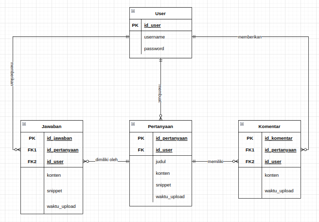
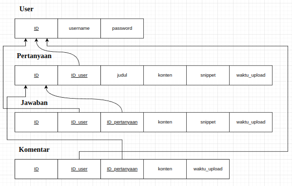

# StackCanary

StackCanary adalah sebuah website forum tanya jawab seputar programming dan ilmu komputer. 

Website ini dibuat sebagai tugas akhir mata kuliah KOM120F Basis Data di mana mahasiswa diminta untuk membuat website atau aplikasi mobile yang terhubung dengan sebuah database dan menerapkan CRUD (Create, Read, Update, dan Delete).

Pembuatan website ini mengimplementasikan framework Django untuk *back-end* serta Bootstrap untuk *front-end*. 

Fitur-fitur dari website ini antara lain sebagai berikut:
- menavigasi berbagai pertanyaan pada halaman utama
- membuat, menyunting, dan menghapus  pertanyaan
- membuat, menyunting, dan menghapus jawaban terhadap salah satu pertanyaan
- membuat, menyunting, dan menghapus komentar terhadap salah satu pertanyaan
- menambahkan snippet kode untuk dimasukkan ke dalam pertanyaan atau jawaban
- melihat semua pertanyaan, jawaban, dan komentar yang telah dibuat oleh user masing-masing dalam satu halaman tertentu
- melihat statistik pertanyaan, jawaban, dan komentar yang telah dibuat oleh user
- mencari pertanyaan tertentu dengan fitur *search*

### Instalasi

Sebelumnya, pastikan bahwa Anda memiliki Python3 dan Django ter-install pada mesin Anda (lebih baik apabila versi terbaru).

```
git clone https://github.com/luqqmman/StackCanary.git
```

### Menjalankan website secara lokal
```
cd StackCanary
python manage.py runserver
```

## Proses Produksi

### Entity Relationship Diagram (ERD)


### Skema Relasional


### Tim Kami
- Muhammad Ghifar Azka Nurhadi (G6401211108)
- Muhammad Luqman Hakim (G6401211094)
- Muhammad Giyas Wisnu Rizqi (G6401211091)